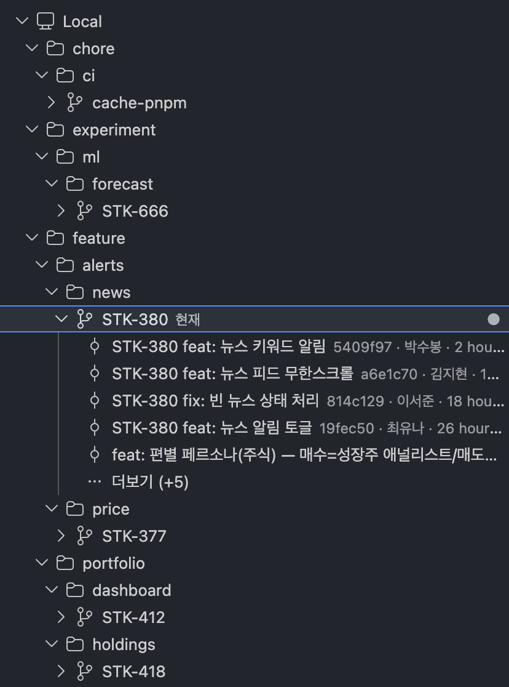
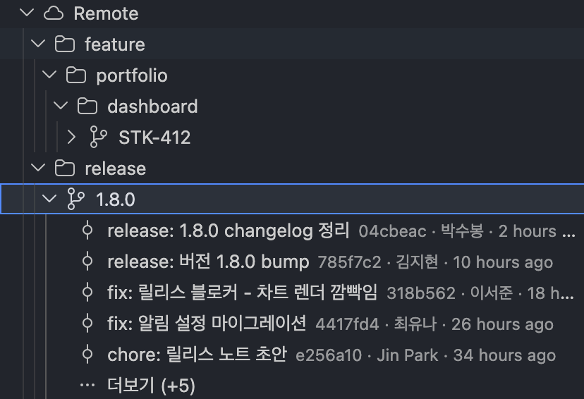

# Git Branch Tree

**English** | [한국어](README.ko.md)

A lightweight VS Code extension that expands the `/` in branch names into an **arbitrary-depth folder tree** and **checks out a leaf branch on click**.

Other branch-tree extensions only collapse a single level. Git Branch Tree fully expands deep naming schemes like `feature/alerts/news/STK-380`, so 3–4 level strategies stay readable.

## Screenshots

| Local | Remote |
| --- | --- |
|  |  |
| Local branches expanded into a multi-depth folder tree, with recent commits under the current branch. | The same tree for the Remote section, with commits under a `release` branch. |

## How it works

```
Local                       ← local branches of the current workspace repo
 ┣ feature
 ┃ ┗ alerts
 ┃   ┗ news
 ┃     ┗ STK-380            (branch · current ✓)
 ┗ master                   (branch)
Remote                      ← refs/remotes (local cache, no network)
 ┗ origin                   (shown only when there are 2+ remotes)
   ┗ ...
```

- **A single click only selects** (no action). Every action lives in the **right-click context menu**.
- **Checkout**: local branches use `git switch <name>`; remote-only branches use DWIM to auto-create a local tracking branch of the same name and switch to it. If something blocks it (dirty tree, etc.), the raw git error is surfaced as-is.
- **Commit history**: expand a branch to see its recent commits (5 at a time). A **Load more** node pulls the next page.
- **Delete a branch**:
  - Local — a modal offers `[Delete]` (safe, `-d`) / `[Force delete]` (`-D`). If an unmerged branch is rejected, it re-confirms before forcing.
  - Remote — `git push <remote> --delete`. Irreversible, so a modal confirmation is required.
- **Create a branch**: the toolbar `+` or right-click a branch (forks from that point). `git switch -c`.
- **Fetch + Prune**: the toolbar `sync` button or right-click the Remote section. Cleans up tracking refs that no longer exist on the server.
- The current branch gets a **green label + ● badge** and is **auto-revealed** when the view opens.
- One remote collapses its name; two or more keep a remote-name folder level.
- **Expand all**: the toolbar `expand-all` button opens every folder at once.
- Refresh: toolbar button + automatically after actions + when the view becomes visible again.

All data is read from the local `git` CLI only. Only delete (remote) and fetch use the network — everything else is **OAuth-free and network-free.**

## Development

```bash
npm install
npm test            # unit tests for the pure tree builder (vitest)
npm run check-types # type check
npm run compile     # esbuild bundle → dist/extension.js
```

Open this folder in VS Code and press **F5** → an Extension Development Host launches and a Branch Tree icon appears in the Activity Bar.

## Packaging (.vsix sideload)

```bash
npm run vsix        # builds release/git-branch-tree-<version>.vsix
code --install-extension release/git-branch-tree-*.vsix
```

## Scope

Checkout · delete (local/remote) · create branch · fetch+prune · commit history. Rename and a separate search box are out of scope (the tree view's built-in type-ahead is enough for search). Assumes a single repo.

## License

[MIT](LICENSE)
